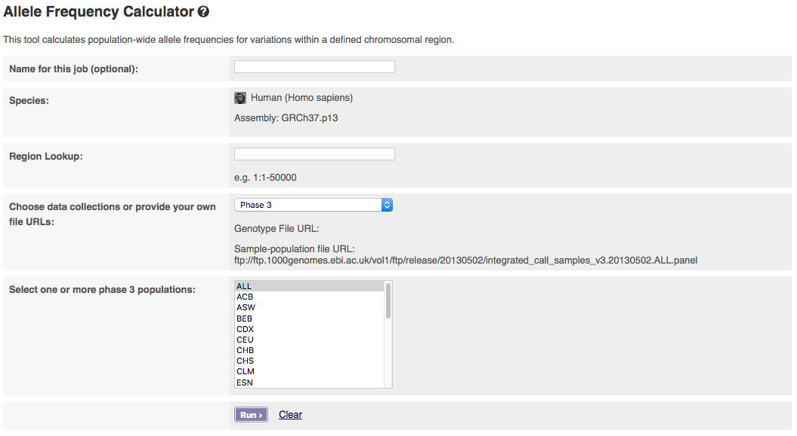

# The Allele Frequency Calculator 

VCF files of variant sites and genotypes, released by the 1000 Genomes Project, are usually annotated with allele frequencies (AF) at the global and continental super population levels. If you also want the AF of certain variants for the specific populations of interest, AF Calculator provides an interface to generate AF for variants in a given genomic interval for a given population. If no specific population is specified, the tool will calculate and output AF for every population in the input files.

You can access the online version of the [allele frequency tool](http://grch37.ensembl.org/Homo_sapiens/Tools/AlleleFrequency?db=core) from the tools link in the menu bar at the top of every page in the [Ensembl GRCh37 browser](http://grch37.ensembl.org/).

The input interface of the online version looks like:

The tool allows you to pick which phase of the 1000 Genomes Project you want to get data from. If you have a publicly visible VCF file, a corresponding tabix index (.tbi) and a corresponding sample-population mapping file in the same folder, you could get data from these by selecting "Provide file URLs".

The calculator must be given a genomic interval to define which sites are to have their frequencies calculated.  For the web-based tool we recommend an interval shorter than 5 Mb to ensure the tool returns in a reasonable time frame.

You can select filtering by populations. To select multiple populations or individuals please hold the ctrl key (on windows/linux) or the cmd key (macs).

## Output:

The output of the calculator can be previewed on the web page and an output file can be downloaded.

Here are a few lines from an example of output file:

CHR POS ID REF ALT TOTAL_CNT ALT_CNT FRQ  
22 17004085 rs182269758 A G 170 9 0.05  
22 17004141 rs192917218 A G 170 2 0.01  
22 17004902 rs4010207 A G 170 12 0.07  
22 17004113 rs186630910 A G 170 9 0.05  
22 17004057 rs187809646 A G 170 11 0.06  
22 17003679 rs2890298 A G 170 12 0.07  
22 17004914 rs5992906 C T 170 66 0.39  
22 17004058 rs190038164 T C 170 4 0.02  
22 17004861 rs4010206 C T 170 0 0  
22 17004497 rs142081770 G T 170 0 0  
22 17004071 rs9605433 G A 170 17 0.1  
22 17004153 rs9680545 G A 170 16 0.09  
22 17004454 rs8135289 T C 170 71 0.42  
22 17004348 rs28417007 T A 170 0 0  
22 17003990 rs146134165 A C 170 28 0.16  
22 17003695 rs56873984 C T 170 17 0.1  
22 17004593 rs145217318 T A 170 0 0  
22 17003703 rs191454176 G A 170 0 0  
22 17003987 rs184186321 T A 170 11 0.06

The header is:

CHR: Chromosome  
POS: Start position of the variant  
ID: Identification of the variant  
REF: Reference allele  
ALT: Alternative allele  
TOTAL_CNT: Total number of alleles in samples of the chosen population(s)  
ALT_CNT: Number of alternative alleles observed in samples of the chosen populations(s)  
FRQ: Ratio of ALT_CNT to TOTAL_CNT
