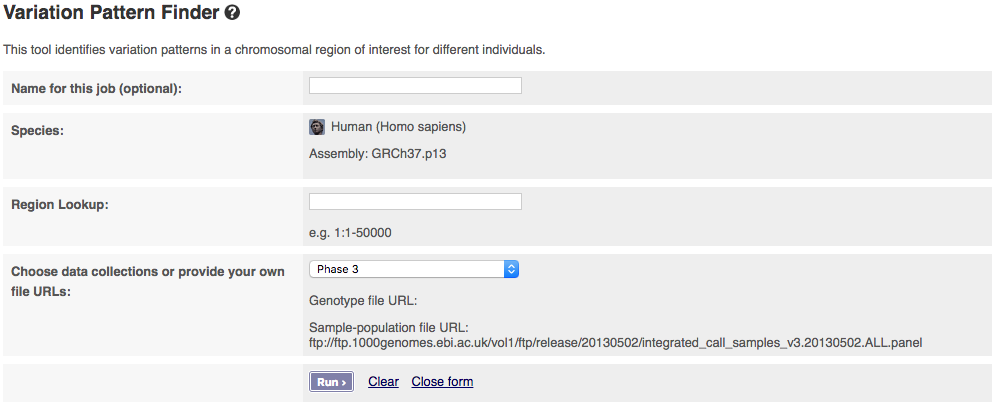

# Variation Pattern Finder

This is documentation about our [Variation Pattern Finder]({{site.browser_url}}/Homo_sapiens/UserData/VariationsMapVCF) tool

[About](#bout)  
[Input Data Formats](input-data-formats)  
[Finder Interface](#finder-interface)  
[Output Formats](#output-format)  
[Using the tool with other data](#own-data)  
[Additional Info](#additional-info)  
[API Script](#api-script)

## About

The variation data discovered by the 1000 genomes project are organised in VCF files. The Variation Pattern Finder allows one to look for patterns of shared variation between individuals in the same vcf file. To be more specific, in any user-specified chromosomal regions, different samples would have different combination of variations. The finder looks for distinct variation combinations within the region, as well as individuals associated with each variation combination pattern. The finder only focuses on variations that change protein coding sequences such as non-synonymous coding SNPs, splice site changes.

## Input

You can access the online version of the [variation pattern finder tool](http://grch37.ensembl.org/Homo_sapiens/Tools/VariationPattern?db=core) from the tools link in the menu bar at the top of every page in the [Ensembl GRCh37 browser](http://grch37.ensembl.org/).

The input interface of the online version looks like:



The tool allows you to pick which phase of the 1000 Genomes Project you want to get data from. If you have a publicly visible VCF file, corresponding tabix index (.tbi) and a corresponding sample-population mapping file in the same folder, you could get data from these by selecting "Provide file URLs".

The pattern finder must be given a genomic interval to search within. This works best with regions of less than 500bp as the number of variation patterns is more manageable.

## Output Format

When your job is complete, you can download a file like:

```freq	1:10177_rs367896724[A]	1:10235_rs540431307[T]	1:10352_rs555500075[T]		samples
freq	ENST00000488147-downstream_gene_variant[],ENST00000450305-upstream_gene_variant[],ENST00000456328-upstream_gene_variant[]	ENST00000488147-downstream_gene_variant[],ENST00000450305-upstream_gene_variant[],ENST00000456328-upstream_gene_variant[]	ENST00000450305-upstream_gene_variant[],ENST00000456328-upstream_gene_variant[],ENST00000488147-downstream_gene_variant[]		samples
13.61	A|AC	-	T|TA	TSI(24)	NA20510, NA20804, NA20787 and 21 others.	CEU(23)	NA12763, NA12003, NA12750 and 20 others.	IBS(23)	HG01626, HG01536, HG02219 and 20 others.	YRI(21)	NA19147, NA19144, NA19172 and 18 others.	PEL(20)	HG02259, HG02278, HG01992 and 17 others.	JPT(18)	NA19001, NA19059, NA18939 and 15 others.	ITU(17)	HG04090, HG04200, HG04076 and 14 others.	CHB(17)	NA18593, NA18626, NA18614 and 14 others.	CLM(16)	HG01137, HG01498, HG01348 and 13 others.	STU(16)	HG03898, HG03858, HG03848 and 13 others.	FIN(14)	HG00268, HG00269, HG00328 and 11 others.	ESN(14)	HG03157, HG03124, HG03354 and 11 others.	GIH(13)	NA21113, NA21099, NA21129 and 10 others.	LWK(11)	NA19393, NA19334, NA19017 and 8 others.	GWD(11)	HG02464, HG02614, HG02819 and 8 others.	PUR(11)	HG01188, HG01396, HG01058 and 8 others.	PJL(10)	HG03765, HG03625, HG02658 and 7 others.	KHV(10)	HG02085, HG02075, HG02081 and 7 others.	GBR(9)	HG00136, HG00239, HG01790 and 6 others.	CHS(7)	HG00406, HG00473, HG00595 and 4 others.	BEB(7)	HG03911, HG03829, HG03934 and 4 others.	MXL(7)	NA19758, NA19731, NA19785 and 4 others.	MSL(7)	HG03563, HG03451, HG03556 and 4 others.	ACB(6)	HG02337, HG02536, HG02111 and 3 others.	ASW(6)	NA20314, NA20348, NA20282 and 3 others.	CDX(3)	HG02187, HG02166, HG02385 and 0 others.	
13.13	AC|A	-	TA|T	JPT(23)	NA18943, NA19074, NA19063 and 20 others.	TSI(19)	NA20760, NA20530, NA20582 and 16 others.	CHB(18)	NA18526, NA18640, NA18544 and 15 others.	GWD(16)	HG02839, HG02570, HG02870 and 13 others.	MSL(16)	HG03225, HG03394, HG03212 and 13 others.	GIH(16)	NA21116, NA20859, NA21089 and 13 others.	GBR(15)	HG00131, HG00115, HG00258 and 12 others.	STU(15)	HG03696, HG03991, HG03697 and 12 others.	ACB(14)	HG02501, HG02558, HG02557 and 11 others.	ITU(14)	HG04059, HG03772, HG03963 and 11 others.	LWK(14)	NA19473, NA19324, NA19323 and 11 others.	CEU(14)	NA12843, NA12762, NA11932 and 11 others.	PEL(13)	HG01967, HG02277, HG02272 and 10 others.	YRI(13)	NA18489, NA19171, NA19239 and 10 others.	KHV(12)	HG02521, HG01596, HG02040 and 9 others.	BEB(11)	HG04141, HG03821, HG04171 and 8 others.	CHS(11)	HG00472, HG00593, HG00448 and 8 others.	IBS(11)	HG01757, HG01631, HG01501 and 8 others.	FIN(11)	HG00177, HG00350, HG00345 and 8 others.	ESN(10)	HG03372, HG03499, HG02943 and 7 others.	PJL(9)	HG03491, HG03667, HG03488 and 6 others.	PUR(9)	HG01077, HG01097, HG01412 and 6 others.	MXL(8)	NA19682, NA19734, NA19773 and 5 others.	ASW(7)	NA20332, NA19704, NA20351 and 4 others.	CLM(5)	HG01124, HG01441, HG01272 and 2 others.	CDX(5)	HG02396, HG02152, HG02180 and 2 others.	
11.50	AC|A	-	T|TA	YRI(24)	NA19099, NA19092, NA19118 and 21 others.	TSI(19)	NA20769, NA20513, NA20538 and 16 others.	GIH(17)	NA20849, NA21117, NA21114 and 14 others.	ITU(15)	HG03727, HG04238, HG03780 and 12 others.	KHV(15)	HG02049, HG01598, HG02057 and 12 others.	ESN(15)	HG03517, HG03367, HG03132 and 12 others.	CEU(13)	NA07056, NA12273, NA10847 and 10 others.	PEL(12)	HG02291, HG02002, HG01948 and 9 others.	LWK(12)	NA19315, NA19310, NA19360 and 9 others.	GWD(12)	HG02678, HG02675, HG02759 and 9 others.	GBR(12)	HG00259, HG01789, HG00157 and 9 others.	BEB(11)	HG03905, HG03009, HG04189 and 8 others.	JPT(11)	NA19012, NA19010, NA19085 and 8 others.	PUR(11)	HG01048, HG01063, HG01405 and 8 others.	CLM(10)	HG01257, HG01431, HG01256 and 7 others.	STU(10)	HG03681, HG03836, HG03757 and 7 others.	ACB(9)	HG02508, HG02497, HG01956 and 6 others.	PJL(9)	HG01593, HG02687, HG02731 and 6 others.	ASW(8)	NA20298, NA20276, NA19711 and 5 others.	FIN(8)	HG00188, HG00190, HG00355 and 5 others.	MXL(7)	NA19655, NA19717, NA19756 and 4 others.	CDX(7)	HG02356, HG02190, HG02353 and 4 others.	CHS(6)	HG00475, HG00525, HG00419 and 3 others.	CHB(6)	NA18639, NA18531, NA18533 and 3 others.	MSL(5)	HG03397, HG03460, HG03058 and 2 others.	IBS(4)	HG01781, HG01608, HG01519 and 1 others.	
10.86	A|AC	-	TA|T	YRI(18)	NA19121, NA18874, NA18519 and 15 others.	ITU(15)	HG03788, HG03773, HG04025 and 12 others.	ACB(15)	HG02545, HG02420, HG02479 and 12 others.	GWD(15)	HG02887, HG02595, HG02643 and 12 others.	STU(14)	HG03738, HG04029, HG03754 and 11 others.	CHB(14)	NA18592, NA18621, NA18638 and 11 others.	LWK(14)	NA19319, NA19332, NA19397 and 11 others.	KHV(13)	HG02086, HG02029, HG02020 and 10 others.	MSL(11)	HG03382, HG03464, HG03432 and 8 others.	IBS(11)	HG01624, HG01672, HG01623 and 8 others.	TSI(11)	NA20828, NA20524, NA20783 and 8 others.	CLM(11)	HG01269, HG01462, HG01133 and 8 others.	PUR(10)	HG01105, HG01311, HG00742 and 7 others.	ESN(10)	HG03195, HG02974, HG02973 and 7 others.	CEU(10)	NA12874, NA12873, NA12287 and 7 others.	MXL(10)	NA19779, NA19741, NA19740 and 7 others.	ASW(9)	NA20296, NA19701, NA19923 and 6 others.	PJL(9)	HG02597, HG02661, HG02733 and 6 others.	FIN(8)	HG00323, HG00186, HG00288 and 5 others.	GIH(8)	NA20891, NA20876, NA21110 and 5 others.	GBR(6)	HG00097, HG00127, HG00140 and 3 others.	JPT(6)	NA18946, NA19086, NA19056 and 3 others.	PEL(6)	HG02089, HG01941, HG02285 and 3 others.	BEB(6)	HG03809, HG03585, HG03919 and 3 others.	CHS(6)	HG00608, HG00625, HG00557 and 3 others.	CDX(6)	HG02185, HG00879, HG02355 and 3 others.	
10.18	-	-	TA|T	CDX(22)	HG01805, HG01031, HG02392 and 19 others.	KHV(21)	HG01855, HG02028, HG01862 and 18 others.	PUR(18)	HG01066, HG01075, HG00641 and 15 others.	CHS(18)	HG00689, HG00581, HG00449 and 15 others.	GWD(16)	HG02610, HG02588, HG02769 and 13 others.	FIN(14)	HG00325, HG00285, HG00282 and 11 others.	CLM(13)	HG01357, HG01130, HG01353 and 10 others.	PJL(13)	HG02700, HG02690, HG02660 and 10 others.	GBR(12)	HG00256, HG00154, HG00101 and 9 others.	STU(9)	HG03899, HG03857, HG03740 and 6 others.	CHB(9)	NA18599, NA18610, NA18582 and 6 others.	MXL(9)	NA19725, NA19651, NA19720 and 6 others.	PEL(9)	HG01947, HG02312, HG01939 and 6 others.	ACB(9)	HG01890, HG01915, HG02143 and 6 others.	IBS(8)	HG01707, HG01686, HG01605 and 5 others.	GIH(7)	NA21130, NA20886, NA21120 and 4 others.	CEU(7)	NA06989, NA07347, NA06985 and 4 others.	MSL(6)	HG03224, HG03472, HG03079 and 3 others.	ESN(5)	HG02979, HG03175, HG03189 and 2 others.	LWK(5)	NA19037, NA19019, NA19372 and 2 others.	ITU(5)	HG04212, HG04219, HG03778 and 2 others.	BEB(5)	HG04177, HG03604, HG03007 and 2 others.	ASW(4)	NA20320, NA19913, NA19916 and 1 others.	JPT(4)	NA19057, NA19060, NA19011 and 1 others.	YRI(4)	NA18877, NA19190, NA18879 and 1 others.	TSI(3)	NA20763, NA20586, NA20511 and 0 others.	
9.30	-	-	T|TA	CHS(19)	HG00728, HG00457, HG00458 and 16 others.	CDX(16)	HG01795, HG00956, HG02373 and 13 others.	IBS(15)	HG01673, HG01675, HG02221 and 12 others.	ACB(14)	HG02144, HG02332, HG02554 and 11 others.	GWD(13)	HG03028, HG02585, HG02465 and 10 others.	CHB(13)	NA18563, NA18560, NA18633 and 10 others.	PUR(13)	HG00640, HG01167, HG01170 and 10 others.	FIN(13)	HG00183, HG00310, HG00373 and 10 others.	ASW(11)	NA20289, NA19901, NA20127 and 8 others.	KHV(9)	HG01843, HG01840, HG02078 and 6 others.	GBR(9)	HG00138, HG00245, HG00257 and 6 others.	LWK(8)	NA19375, NA19401, NA19327 and 5 others.	YRI(8)	NA18924, NA19213, NA18865 and 5 others.	CLM(8)	HG01390, HG01365, HG01354 and 5 others.	CEU(8)	NA10851, NA11831, NA11920 and 5 others.	MXL(8)	NA19788, NA19759, NA19681 and 5 others.	PEL(8)	HG01950, HG01997, HG01927 and 5 others.	PJL(8)	HG02789, HG02654, HG02688 and 5 others.	GIH(6)	NA21123, NA20897, NA20904 and 3 others.	STU(6)	HG03886, HG03888, HG04210 and 3 others.	BEB(5)	HG04164, HG03006, HG04144 and 2 others.	ESN(5)	HG02944, HG03139, HG03166 and 2 others.	ITU(4)	HG04202, HG04198, HG04222 and 1 others.	JPT(4)	NA18999, NA19006, NA18997 and 1 others.	TSI(1)	NA20762	MSL(1)	HG03054	
6.07	AC|AC	-	TA|T	MSL(17)	HG03476, HG03461, HG03081 and 14 others.	ESN(15)	HG03118, HG02970, HG03271 and 12 others.	GIH(12)	NA20853, NA20858, NA20900 and 9 others.	STU(12)	HG03690, HG03950, HG03846 and 9 others.	GWD(10)	HG03247, HG03025, HG02816 and 7 others.	TSI(10)	NA20536, NA20539, NA20818 and 7 others.	CDX(8)	HG02181, HG02186, HG02410 and 5 others.	JPT(8)	NA18976, NA18947, NA18981 and 5 others.	BEB(7)	HG03922, HG03830, HG03910 and 4 others.	PEL(7)	HG01965, HG02345, HG01961 and 4 others.	ACB(6)	HG02442, HG02489, HG01894 and 3 others.	ITU(6)	HG04017, HG04061, HG04018 and 3 others.	CLM(6)	HG01363, HG01444, HG01486 and 3 others.	YRI(6)	NA19160, NA19107, NA19159 and 3 others.	IBS(4)	HG01756, HG02223, HG01669 and 1 others.	LWK(3)	NA19312, NA19446, NA19437 and 0 others.	CEU(3)	NA11933, NA12749, NA12716 and 0 others.	PJL(2)	HG03234, HG03660	KHV(2)	HG01870, HG02047	GBR(2)	HG00244, HG01334	FIN(2)	HG00181, HG00176	PUR(2)	HG01303, HG01092	CHB(1)	NA18627	ASW(1)	NA20339	
5.95	AC|AC	-	T|TA	BEB(20)	HG04159, HG03926, HG03607 and 17 others.	MSL(18)	HG03437, HG03547, HG03066 and 15 others.	ESN(14)	HG03342, HG02947, HG03267 and 11 others.	GWD(12)	HG02884, HG02891, HG02878 and 9 others.	ITU(11)	HG03977, HG03976, HG03779 and 8 others.	TSI(10)	NA20814, NA20522, NA20754 and 7 others.	STU(8)	HG03645, HG03646, HG03897 and 5 others.	GIH(7)	NA20884, NA20846, NA20847 and 4 others.	JPT(7)	NA18974, NA18971, NA18956 and 4 others.	PJL(6)	HG03490, HG03235, HG03629 and 3 others.	ACB(6)	HG02477, HG02433, HG01989 and 3 others.	CEU(4)	NA12842, NA12813, NA11894 and 1 others.	YRI(4)	NA19256, NA18870, NA18853 and 1 others.	IBS(4)	HG01670, HG01507, HG01530 and 1 others.	CLM(3)	HG01468, HG01479, HG01260 and 0 others.	LWK(3)	NA19445, NA19462, NA19321 and 0 others.	PEL(3)	HG01973, HG02425, HG01572 and 0 others.	PUR(3)	HG01312, HG01326, HG01089 and 0 others.	KHV(2)	HG01597, HG01872	FIN(2)	HG00360, HG00362	CDX(1)	HG02188	GBR(1)	HG01791	
4.15	AC|A	-	-	CEU(8)	NA07048, NA12046, NA11930 and 5 others.	PJL(7)	HG03706, HG02655, HG03708 and 4 others.	IBS(7)	HG01704, HG01516, HG01682 and 4 others.	PUR(7)	HG01308, HG01101, HG01182 and 4 others.	ASW(7)	NA20126, NA20340, NA19834 and 4 others.	GIH(6)	NA21104, NA20901, NA21119 and 3 others.	BEB(5)	HG04176, HG03803, HG03793 and 2 others.	CLM(5)	HG01474, HG01254, HG01378 and 2 others.	ACB(4)	HG02308, HG01958, HG02322 and 1 others.	MXL(4)	NA19771, NA19776, NA19792 and 1 others.	CDX(4)	HG01801, HG01808, HG02394 and 1 others.	CHB(4)	NA18530, NA18565, NA18538 and 1 others.	GBR(4)	HG00155, HG00129, HG00234 and 1 others.	FIN(4)	HG00334, HG00356, HG00309 and 1 others.	STU(4)	HG03684, HG03896, HG04047 and 1 others.	ITU(3)	HG04235, HG03862, HG04054 and 0 others.	LWK(3)	NA19355, NA19318, NA19027 and 0 others.	YRI(3)	NA18876, NA19138, NA19096 and 0 others.	MSL(3)	HG03074, HG03077, HG03052 and 0 others.	ESN(3)	HG03133, HG03111, HG03109 and 0 others.	KHV(2)	HG02137, HG02016	JPT(2)	NA19089, NA18966	TSI(2)	NA20767, NA20587	PEL(1)	HG02104	CHS(1)	HG00428	GWD(1)	HG02642	
3.71	A|AC	-	-	PJL(8)	HG03652, HG03702, HG02657 and 5 others.	CHS(8)	HG00599, HG00729, HG00698 and 5 others.	CLM(6)	HG01556, HG01344, HG01277 and 3 others.	IBS(6)	HG01630, HG01525, HG01765 and 3 others.	KHV(5)	HG02133, HG02127, HG02122 and 2 others.	ITU(5)	HG03882, HG03771, HG03874 and 2 others.	CDX(4)	HG02386, HG02382, HG00867 and 1 others.	CHB(4)	NA18740, NA18602, NA18591 and 1 others.	CEU(4)	NA12889, NA11840, NA12812 and 1 others.	YRI(4)	NA19247, NA19198, NA19185 and 1 others.	ACB(4)	HG02053, HG02484, HG02054 and 1 others.	FIN(4)	HG00358, HG00339, HG00371 and 1 others.	STU(4)	HG03673, HG03642, HG03985 and 1 others.	GBR(4)	HG02215, HG00125, HG00160 and 1 others.	PEL(3)	HG02301, HG02271, HG02006 and 0 others.	PUR(3)	HG01061, HG01064, HG00732 and 0 others.	GIH(3)	NA21111, NA21107, NA21142 and 0 others.	TSI(3)	NA20832, NA20514, NA20764 and 0 others.	MXL(2)	NA19657, NA19723	GWD(2)	HG02613, HG02666	BEB(2)	HG04131, HG03917	ESN(2)	HG03193, HG03190	JPT(2)	NA18959, NA18964	LWK(1)	NA19384	
1.16	A|AC	-	TA|TA	LWK(10)	NA19452, NA19431, NA19316 and 7 others.	JPT(4)	NA19077, NA18972, NA19084 and 1 others.	CHB(3)	NA18617, NA18631, NA18612 and 0 others.	IBS(2)	HG01668, HG01776	GBR(2)	HG00150, HG00114	MSL(1)	HG03578	TSI(1)	NA20581	CHS(1)	HG00634	ACB(1)	HG02471	PJL(1)	HG02778	CLM(1)	HG01384	CEU(1)	NA12275	MXL(1)	NA19746	
1.12	AC|A	-	TA|TA	LWK(8)	NA19468, NA19438, NA19436 and 5 others.	JPT(4)	NA19076, NA19083, NA18987 and 1 others.	ACB(3)	HG02449, HG02429, HG02450 and 0 others.	CHS(3)	HG00530, HG00705, HG00537 and 0 others.	TSI(2)	NA20540, NA20774	CHB(2)	NA18615, NA18745	IBS(1)	HG01602	ASW(1)	NA20278	STU(1)	HG03694	FIN(1)	HG00367	YRI(1)	NA18871	CEU(1)	NA11893	
0.56	AC|AC	-	TA|TA	JPT(6)	NA19081, NA19088, NA19075 and 3 others.	LWK(3)	NA19430, NA19463, NA19448 and 0 others.	TSI(1)	NA20792	ESN(1)	HG03366	CDX(1)	HG02408	GWD(1)	HG02896	YRI(1)	NA18522	
0.48	-	-	TA|TA	FIN(4)	HG00187, HG00171, HG00344 and 1 others.	CHS(3)	HG00611, HG00542, HG00663 and 0 others.	LWK(1)	NA19471	CLM(1)	HG01461	PUR(1)	HG01085	ESN(1)	HG03126	JPT(1)	NA19070	
0.20	AC|AC	-	-	BEB(1)	HG03589	ITU(1)	HG04023	ASW(1)	NA20357	GIH(1)	NA21094	PUR(1)	HG01286	
0.08	A|AC	TA|T	T|TA	PEL(1)	HG01970	STU(1)	HG03989	
0.08	A|AC	T|TA	T|TA	STU(1)	HG03644	ITU(1)	HG04056	
0.08	AC|A	TA|T	TA|T	PJL(1)	HG02600	GIH(1)	NA21141
```

The file is tab separated. The first line begins with `freq` then lists all the variants found within the region in the form `chromosome:coordinate_rsID[variant allele]`, each in their own column, then ends with `samples`. The second line also starts and ends with `freq` and `samples`, and under each variant column lists the transcript(s) hit by each variant and the consequence on that transcript, separated by columns.

The following lines give the variant patterns. The first `freq` column gives the frequency of each pattern, the variant columns list the phased genotype for those particular variants in the pattern, and the final `samples` column lists the populations where individuals are found with those patterns, the number of individuals and the identifiers of the first three individuals.

## Using the Variation Pattern Finder with other data

The Variation Pattern Finder will work with any publicly visible remove (over http or ftp) vcf file which also has a tabix index. For more information about creating tabix indexes please look at [Tabix: fast retrieval of sequence features from generic TAB-delimited files](http://bioinformatics.oxfordjournals.org/content/27/5/718.short?rss=1) for more information about creating these indexes.

## Additional Info

In addition to use the Finder to mine the VCF file, you may look into a VCF file directly. Rather than download the entire VCF file for the whole genome, you may slice out the piece of VCF file that contains data in a user-specified chromosomal region using another tool called [Data Slicer](http://www.internationalgenome.org/data-slicer/). Data Slicer can also slice BAM files.

## API Script

You can also find a perl script version of this tool [on the Ensembl GRCh37 tools page](http://grch37.ensembl.org/info/docs/tools/index.html).
